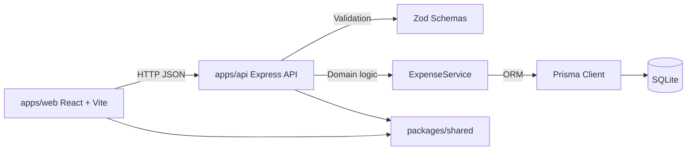
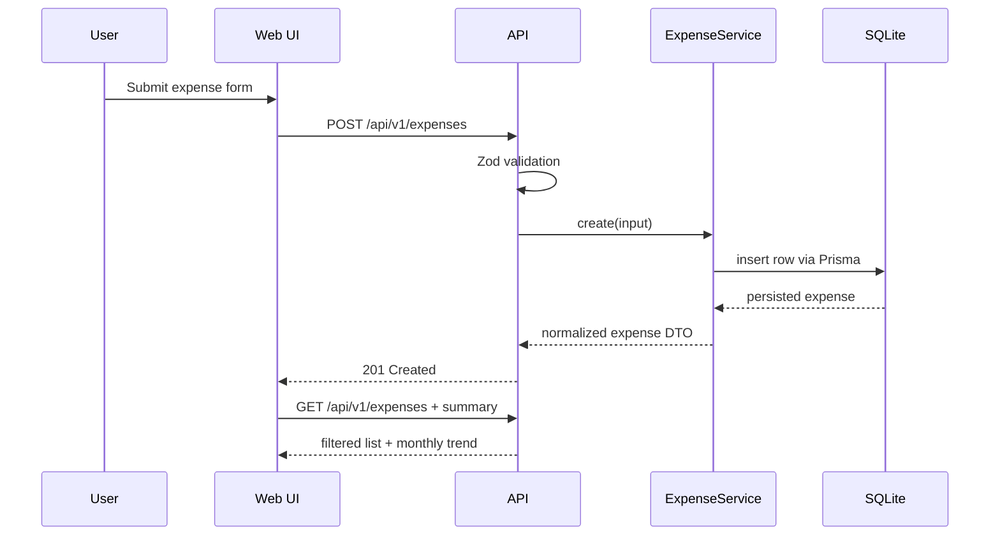

# Architecture

## Module Diagram

## Data Flow

## Notes

- Shared schemas in `packages/shared` avoid contract drift.
- API errors use explicit `code/message/details` payload.
- Summary trend compares selected month total to previous month.
